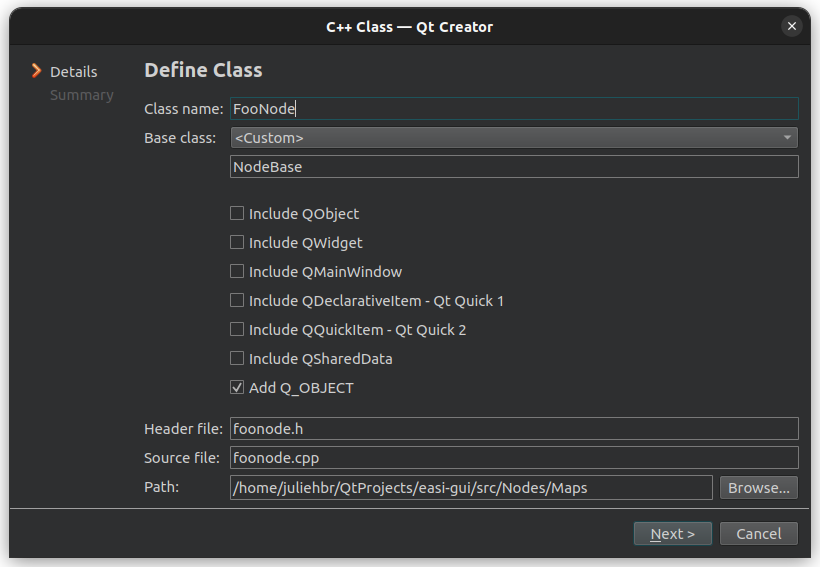
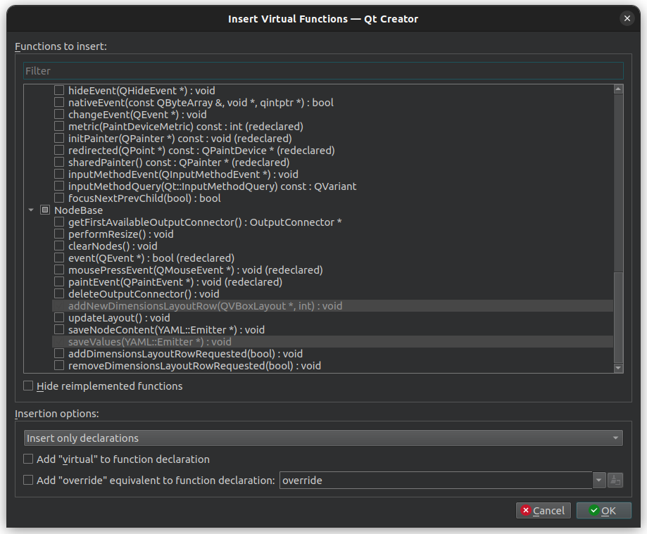
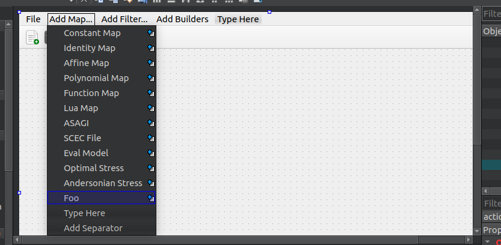
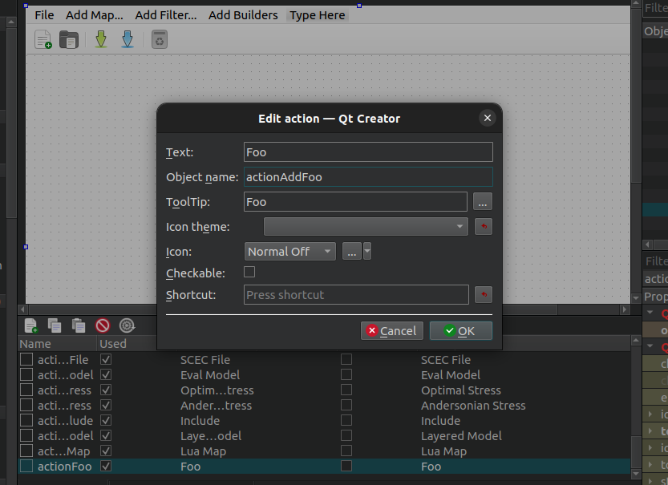
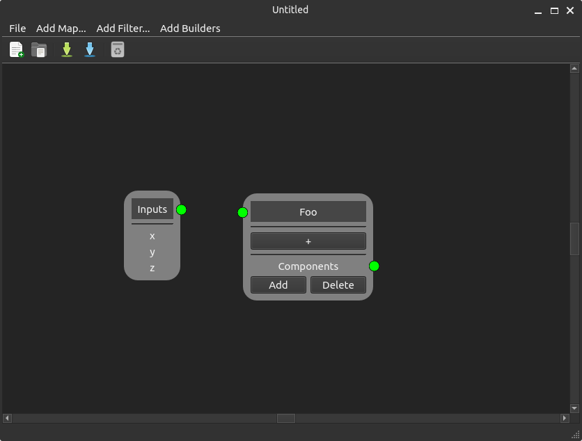
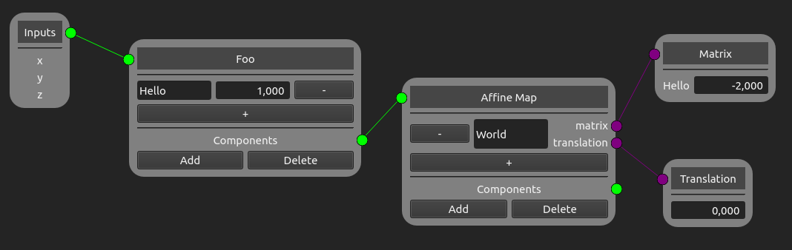
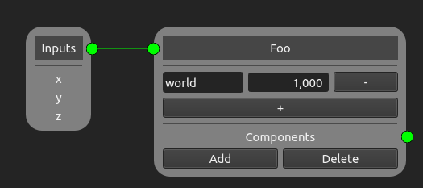
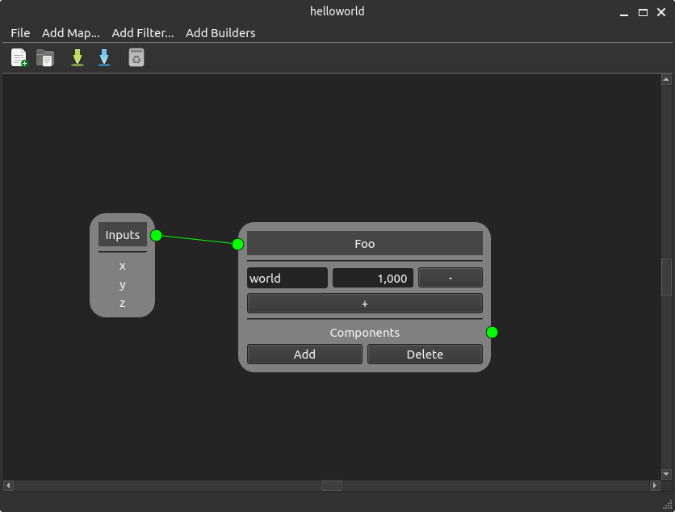

How to create new nodes
=======================

If new easi components are created, you may want to expand easi-gui by creating their corresponding nodes. Here is a tutorial to explain how the code works and how new nodes can be added. If you haven't read it yet, please read `Understanding the program's structure <https://easi-gui.readthedocs.io/en/latest/program_structure.html>`_ first.

If you have an idea of how the program looks like, let's create a new map node called **FooNode**. FooNode should implements the following easi map:

.. code-block:: YAML

    !Foo
    hello:
      <dimension>: <double>
      <dimension>: <double>
    ...

:Domain:
  *inherited*
:Codomain:
  keys in hello

It will have the 3 basic layouts: the title layout, the dimensions layout and the components layout. The dimensions layout is the only one you will need to write. It will contains a list of editable lines and spin boxes (basically, it will looks like the **Constant Map** node).

1 - Creating a new class
------------------------

If you have never used QtCreator before, it may be usefull to follow the next steps: 

1. Open the project easi-gui.pro in QtCreator. 
2. Right-click on the folder "maps". Then select "Add New...".
3. Under "C/C++", select "C++ Class" and click on "Choose...".
4. Enter "FooNode" as the class name. Select <custom> as BaseClass and enter "NodeBase" in the field under it. Make sure "Add Q_OBJECT" is checked, then click on "Next >" and finally on "Finish".

Before going to the next step, open ``footnode.h`` and replace 

.. code-block:: cpp

   #include <nodebase.h> 

by 

.. code-block:: cpp

   #include "src/Nodes/nodebase.h"

Now, let's add the two main methods of NodeBase we will need. Right-click on FooNode or NodeBase in ``foonode.h``, then click on "Refactor" and select "Insert Virtual Functions of Base Classes". Scroll down until you see NodeBase and select the following methods:

.. code-block:: cpp

   addNewDimensionsLayoutRow(QVBoxLayout*, int) : void
   saveValues(YAML::Emitter*) : void
   

Add the definition of these two methods in ``foonode.cpp`` (right-click on FooNode in ``foonode.h``, then "Refactor", "Create Implementations for Member Functions" and "OK").

2 - Creating the Layout of FooNode
----------------------------------

Like we said earlier, FooNode needs the title layout, the dimensions layout and the components layout. Luckily, there is a method in NodeBase that already creates the three of them for us. However, you need to give some information to the node, otherwise you may get some weird results. The necessary information is:

* type of node (used by easi-gui to easily determine which node it is dealing with)
* local tag (used as local tag when saved into a yaml file - corresponds to the line "!Foo")
* index of the remove button (position of the - button inside a dimension row, is -1 by default)
* index of the dimension's editable line (position of the editable lines inside a dimension row, is -1 by default)
* title of the node (used when creating the title layout by NodeBase)

Before passing the information, you need to create the type of node, since it is a new node. Go to ``nodebase.h`` and add the following lines among the maps, before the class declaration: 

.. code-block:: cpp

   #define FOONODE 26;
   
Now go to ``foonode.cpp``. The type of node is then FOONODE. Since "!Foo" is a local tag, the variable localTag should be set as "Foo" (yaml-cpp adds the exclamation point). The **Foo** node should then look like the **Constant Map** node. This means that, in each dimension's row, it will have first an editable line, then a spin box and finally a remove button. The indexes for the remove button and the editable line are then respectively 2 and 0. As for the title, "foo" ist enough. In the constructor, add the following lines:

.. code-block:: cpp

   typeOfNode = FOONODE;
   localTag = "Foo";
   removeButtonIndex = 2;
   dimensionLineEditIndex = 0;
   setWindowTitle("Foo");

Now that the information is set, you can create the layout of FooNode by calling the following method:

.. code-block:: cpp

   createLayout();
   
To make sure your whole node is selectable, it is necessary to add this last line to the constructor:
   
.. code-block:: cpp

   setGeometry(QRect(0, 0, sizeHint().width(), sizeHint().height()));

3 - Preparing WidgetsHandler
----------------------------

Before changing FooNode any further, let's make sure it can be added to the scene without any problem. Open ``widgetshandler.h`` and add this function after "addAndersonianStressNode":

.. code-block:: cpp

   QGraphicsProxyWidget* addFooNode(QPointF pos = QPointF(50000, 2500));

The parameter *pos* stands for the position of the node in the scene. By default, it is (50000,2500). Then add the definition of this method in ``widgetshandler.cpp`` (right-click on the method, then "Refactor", finally "Add Definition in widgetshandler.cpp"). Go to ``widgetshandler.cpp`` if you are not already in it, and includes FooNode. 

.. code-block:: cpp

   #include "src/Nodes/Maps/foonode.h"

The function addFooNode will be divided in three parts. In the first one, the node is added. In the second one, you will add an input connector, and in the last one, an output connector. Let's start by adding the node. Go find the function addFooNode and create the node:

.. code-block:: cpp

   FooNode* fooNode = new FooNode();

WidgetsHandler provides a method that adds nodes and deals with the needed signal-slot connections. This method takes a node and its position in the scene as parameters, and gives a QGraphicsProxyWidget back. Since the nodes are widgets and not items, you need this proxy as well as a QGraphicsWidget as the proxy's parent to be able to manipulate the nodes (despite its name, QGraphicsWidget is an item). The QGraphicsWidget parent of the nodes is the class NodeParentWidget. Add the next two lines to the method:

.. code-block:: cpp
  
   QGraphicsProxyWidget* proxyNode = addNode(fooNode, pos);
   NodeParentWidget* nodeParentWidget = static_cast<NodeParentWidget*>(proxyNode->parentWidget());

The node is now added to the scene. Adding a connector works the same way:

1. You first create an instance InputConnector. Note that you need to give it a NodeParentWidget as parameter. Give it your nodeParentWidget.
2. Call the method addInputConnector(). It takes the inputConnector, the proxy of the node as well as a position as parameters. For the position, uses QPointF(-8,20). 
3. You do then exactly the same with an instance of OutputConnector. The method to add it to the scene is addOutputConnector, and the position is QPointF(fooNode->geometry().width() - 7, fooNode->geometry().height() - 58).

Here's the code:

.. code-block:: cpp
  
   // Add one input connector
   InputConnector* inputConnector = new InputConnector(nodeParentWidget);
   addInputConnector(inputConnector, proxyNode, QPointF(-8, 20));

   // Add one output connector
   OutputConnector* outputConnector = new OutputConnector(nodeParentWidget);
   QPointF connectorPos(fooNode->geometry().width() - 7, fooNode->geometry().height() - 58);
   addOutputConnector(outputConnector, proxyNode, connectorPos);

To finish, you have to return the proxy of the node:

.. code-block:: cpp
  
   return proxyNode;

4 - Preparing MainWindow
------------------------

Now that the **Foo** node can be added to the scene, let's change the ui, such that you can test it.

Open ``mainwindow.ui``. You should enter the Design view. If you are still in the Edit view, click on "Design" on the left tab. In the central view, click on the menu "Add Map...", then select "Type Here" at the end of the menu and enter "Foo".

To maintain the same naming convention inside of easi-gui, let's change the name of the object. Below the window in the central view, you have a list of all actions created for easi-gui. At the end ot the list, you should find "actionFoo". Double click on it and change the object name to "actionAddFoo".

  
Now, save your changes and open ``mainwindow.h``. At the end of the the file, you will find a list of the private slots of the class. After the "action add maps", add the method

.. code-block:: cpp

   void actionAddFoo();

Add the definition of this method in ``mainwindow.cpp`` (right-click on the method, then "Refactor", finally "Add Definition in mainwindow.cpp"). This method is the one that says WidgetsHandler to add a **Foo** node. Add the following statement to the method:

.. code-block:: cpp

   widgetsHandler->addFooNode();

Let's not forget to connect the object of the ui to the MainWindow function. In the method ``MainWindow::connectActions()``, add the following line among the others "add maps actions":

.. code-block:: cpp

   connect(ui->actionAddFoo, SIGNAL(triggered(bool)), this, SLOT(actionAddFoo()));

If you run easi-gui (Ctrl-R), you should be able to add a **Foo** node to the scene, move it wherever you want on the scene and connect it to other nodes. 

However, clicking on the + button does nothing, and saving it will not work as expected.

5 - Finishing the implementation of FooNode
-------------------------------------------

5.1 - Implementing the Dimensions Layout
^^^^^^^^^^^^^^^^^^^^^^^^^^^^^^^^^^^^^^^^

When you click on the + button, the method ``addNewDimensionsLayoutRow`` is called. However, you haven't implemented it yet. Go back to ``foonode.cpp``. The method has two parameters: a QVBoxLayout* called dimensionsLayout, and an index. The index says where the row will be inserted in the dimensionsLayout.

First, let's create a row of type QHBoxLayout*.

.. code-block:: cpp

   QHBoxLayout* row = new QHBoxLayout();

Let's recall the order in which the items should appear: first a editable line, then a spin box and finally the remove button. 

The editable line has a small particularity. The outputs should be automatically transfered to the children of the **Foo** node. This means we need to update the outputs, whenever we type something. A method already exists for this and is called ``dimensionNameChanged``. Besides that, if the outputs are given, the rows are automatically added when ``createLayout()`` is called. Therefore, the content of the line will be either an already existing output, or the outputs list will be further expanded. NodeBase has a method called ``addLineEdit``, which adds an editable line to a layout. It takes the layout, the placeholder text and the row index as parameters. Let's choose "Dimensions X" as placeholder text, where X is the row index:

.. code-block:: cpp

   QLineEdit* dimension = addLineEdit(row, "Dimension " + QString::number(index), index);

Then, if the list contains an output at this index, it adds it to the line, otherwise, it expands the list with an empty string. Note that the index can not be bigger than outputs->size() + 2:
   
.. code-block:: cpp

   if (outputs->size() > index)
       dimension->setText(outputs->at(index));
   else
       outputs->append("");

Finally, you need to connect this editable line to the slot ``dimensionNameChanged`` we mentioned earlier:
   
.. code-block:: cpp

   connect(dimension, SIGNAL(textChanged(QString)), this, SLOT(dimensionNameChanged(QString)));

For the rest of the row, NodeBase also has methods, ready to be used: ``addDoubleSpinBox``, which takes the layout as parameter, and ``addRemoveButton``, which takes the layout and the row index as parameters:

.. code-block:: cpp

   // add input field to get the value of the parameter
   addDoubleSpinBox(row);

   // add button to remove dimension
   addRemoveButton(row, index);
   
The last thing to do is to insert the row into dimensionsLayout:

.. code-block:: cpp

   dimensionsLayout->insertLayout(index, row);

If you run easi-gui again, you should be able to click on the + button and edit it.

5.2 -Saving the values
^^^^^^^^^^^^^^^^^^^^^^

You are almost done! The next step is to save the content of the **Foo** nodes. As said before, the content is saved in ``saveValues``. To be exact, the local tag is saved by the NodeBase function ``saveNodeContent``, so you will only save the rest of the node. Before saving them, let's create a method that gives us the dimensions layout content. In ``foonode.h``, create the function

.. code-block:: cpp

   QMap<QString, double>* getValues();

and add its definition to ``foonode.cpp`` (right-click on the method, then "Refactor", finally "Add Definition in foonode.cpp"). As you can guess, we will map the values of the spin boxes to the dimensions' names. In the function in ``foonode.cpp``, create a QMap<QString, double>* instance called values:

.. code-block:: cpp

   QMap<QString, double>* values = new QMap<QString, double>();

Then, you need to retrieve the dimensions layout. It has been named "dimensionsLayout" by NodeBase and can be retrieved using the ``findChild`` method of QLayout:

.. code-block:: cpp

   QObjectList dimensionsLayout = this->layout()->findChild<QVBoxLayout*>("dimensionsLayout")->children();

The function gives the rows as a list of QObject. You will need to iterate through it and cast its type to "QHBoxLayout*". Then, you can retrieve the name and value of each dimension using the indices of the items and save them into the QMap:

.. code-block:: cpp

   foreach (QObject* layout, dimensionsLayout)
   {
       QHBoxLayout* row = static_cast<QHBoxLayout*>(layout);
       QString name = static_cast<QLineEdit*>(row->itemAt(0)->widget())->text();
       double value = static_cast<QDoubleSpinBox*>(row->itemAt(1)->widget())->value();
       values->insert(name, value);
   }

Return the QMap and go back to the ``saveValues`` method.

.. code-block:: cpp

   return values;

First, let's retrieve the values via ``getValues()``:

.. code-block:: cpp

   QMap<QString, double>* values = getValues();

Then, let's take a look again at how the yaml code should look like:

.. code-block:: YAML

    !Foo
    hello:
      <dimension>: <double>
      <dimension>: <double>
    ...
    
As said before, "!Foo" has already been added by NodeBase. Note that the content of the nodes are already stored inside a map, so "hello" can then be added directly as a ``YAML::Key``. Its ``YAML::Value`` is a new map, in which each dimension's name is a key and each dimension's value is a value. Here's the code:

.. code-block:: cpp

   *out << YAML::Key << "hello";
   *out << YAML::Value << YAML::BeginMap;
   QStringList sortKeys = values->keys();
   foreach (QString key, sortKeys)
   {
       *out << YAML::Key << key.toStdString();
       *out << YAML::Value << values->value(key);
   }
   *out << YAML::EndMap;

Let's not forget to free the memory:

.. code-block:: cpp

   delete values;

Run again your application, create a new **Foo** node, add a dimension called "world" and give it as value 1. Then connect the **Foo** node to the **Inputs** and save your file.

If you open the file in a text editor, you should see the following:

.. code-block:: YAML

   !Foo
   hello:
     world: 1

5.3 - Preparing FooNode for being opened
^^^^^^^^^^^^^^^^^^^^^^^^^^^^^^^^^^^^^^^^

For now, each time our node is added to the scene, it is empty. It then needs to be able to be created directly with the values. Let's create another constructor that takes a QSharedPointer<QStringList> and a QList<double>* as parameters (we assume that the outputs and the values are stored in the same order):

.. code-block:: cpp
   
   FooNode(QSharedPointer<QStringList> outputs, QList<double>* values);
   
Add its definition to ``foonode.cpp`` (right-click on the method, then "Refactor", finally "Add Definition in foonode.cpp") and go to your new constructor in ``foonode.cpp``. As we said earlier, the dimensions rows are automatically added by ``createLayout()`` when there are some outputs. Extend then the first constructor and give it ``QSharedPointer<QStringList> outputs`` as parameter:

.. code-block:: cpp
   
   FooNode(QSharedPointer<QStringList> outputs = nullptr);

Don't forget to update the constructor in ``foonode.cpp`` and pass the outputs to its parent. Note that the constructor of NodeBase takes the inputs before the outputs, so you need to pass it a null pointer:

.. code-block:: cpp
   
   FooNode::FooNode(QSharedPointer<QStringList> outputs) : NodeBase(nullptr, outputs)
   {
       ...
   }

Let's go back to our other constructor, call the first constructor from it and pass the outputs. The list values could also be null, so let's return if values is a null pointer:

.. code-block:: cpp
   
   FooNode::FooNode(QSharedPointer<QStringList> outputs, QList<double>* values) : FooNode(outputs)
   {
       
   }

Now, all rows have already been created, and you only need to fill the spin boxes. First, let's return if values is a null pointer:

.. code-block:: cpp
   
   if (values == nullptr)
      return;

Then, exactly as you did to get the values, retrieve the dimensions layout and iterate through it. Don't forget to cast the rows to QHBoxLayout*. Now you need to get the index in the outputs list of the current dimension name, so that you can get the corresponding value (since the outputs and values are stored in the same order). With it, you can set the value of the spin box.

.. code-block:: cpp
   
   QObjectList dimensionsLayout = this->layout()->findChild<QVBoxLayout*>("dimensionsLayout")->children();
    foreach (QObject* layout, dimensionsLayout)
    {
        QHBoxLayout* row = static_cast<QHBoxLayout*>(layout);
        int index = outputs->indexOf(static_cast<QLineEdit*>(row->itemAt(0)->widget())->text());
        static_cast<QDoubleSpinBox*>(row->itemAt(1)->widget())->setValue(values->at(index));
    }
    
Let's not forget to release the memory:

.. code-block:: cpp
   
   delete values;

6 - Update WidgetsHandler
-------------------------

If you try to run easi-gui, you will get an error, since you have changed the FooNode constructor. Go to ``widgetshandler.h`` and let's update the ``addFooNode`` signature. We already know that we need to pass a QSharedPointer<QStringList> and a QList<double>* to the parameters. The function should now look like this:

.. code-block:: cpp
   
   QGraphicsProxyWidget* addFooNode(QPointF pos = QPointF(50000, 2500), QSharedPointer<QStringList> outputs = nullptr, QList<double>* values = nullptr);

Update the signature of this method in ``widgetshandler.cpp`` and pass outputs and values to the declaration of fooNode:

.. code-block:: cpp
   
   QGraphicsProxyWidget *WidgetsHandler::addFooNode(QPointF pos, QSharedPointer<QStringList> outputs, QList<double>* values)
   {
       FooNode* fooNode = new FooNode(outputs, values);
       ...
   }

7 - Opening the Node
--------------------

This is the last step! Go back to ``MainWindow.h``. Among the open functions, add the following one:

.. code-block:: cpp
   
   void openFooNode(QGraphicsProxyWidget* parentProxyNode, YAML::Node* node, QSharedPointer<QStringList> inputs);

Add the definition of this method in ``mainwindow.cpp`` (right-click on the method, then "Refactor", finally "Add Definition in mainwindow.cpp"). It has three parameters: the proxy of the parent node, to which our **Foo** node needs to be connected, our **Foo** node as ``YAML::Node``, and the outputs of the parent, which become the inputs of our **Foo** node. Since it doesn't need any input, you can add the following line to avoid the warnings:

.. code-block:: cpp
   
   Q_UNUSED(inputs);
   
Then, let's check if the yaml node is correctly implemented. It should have the "hello" map:

.. code-block:: cpp
   
   if (!(*node)["hello"])
       return;

Then, create the two lists outputs and values, that will retrieve the values from the yaml file:

.. code-block:: cpp
   
   QSharedPointer<QStringList> outputs = QSharedPointer<QStringList>(new QStringList);
   QList<double>* values = new QList<double>();

Now that everything is ready, you can iterate through the "hello" map and retrieve the dimensions names and values:

.. code-block:: cpp
   
   for (YAML::const_iterator it = (*node)["hello"].begin(); it != (*node)["hello"].end(); ++it)
   {
       *outputs << it->first.as<std::string>().c_str();
       *values << it->second.as<double>();
   }

To finish, you need to add the node. 

However, it would be nice if the node is next to its parent. You can use the function ``widgetsHandler->getPosNextTo`` to retrieve its position (it takes the proxy of the parent node as argument). 

After having added the **Foo** node, it needs to be connected to its parent. Luckily for you, another method also already exists for this: ``widgetsHandler->connectNodes``. It takes the parent node and the node (not the proxies!) as arguments.

Now that the node is added and connected, its components come next. Just call the method ``openComponents`` and give it the proxy of the **Foo** node, the current YAML::Node and the outputs as arguments.

.. code-block:: cpp
   
    // add node
    QGraphicsProxyWidget* proxyNode = widgetsHandler->addFooNode(widgetsHandler->getPosNextTo(parentProxyNode), outputs, values);

    // connect them
    widgetsHandler->connectNodes(static_cast<NodeBase*>(parentProxyNode->widget(), static_cast<NodeBase*>(proxyNode->widget());

    openComponents(proxyNode, node, outputs);

Maybe you have already thought about it but there is a last small step to this tutorial: ``openFooNode`` has not be called yet. For this, look for ``openNode`` and add this condition among the other map conditions:

.. code-block:: cpp

   else if (tagOfNode == "!Foo")
       openFooNode(parentProxyNode, node, outputs);

You are officially done! You can save the project, run easi-gui and open the file you saved earlier:

