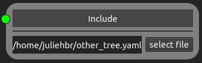

Builders
========

Builders are not components by itself, but build a subtree using available components. The following builder nodes implements the 
`builders <https://easyinit.readthedocs.io/en/latest/builders.html>`_ of easi. If you are not familiar with the different easi builders, please read the easi documentation first.

Note that easi-gui does not check for typos or wrong inputs/outputs.

Layered Model Node
------------------

This node implements `LayeredModel <https://easyinit.readthedocs.io/en/latest/builders.html#layeredmodel>`_ of easi. It defines parameters at nodes, which are interpolated inbetween nodes.

.. figure:: fig/builders/layeredmodel.png
  :alt: LayeredModel
  
  This Layered Model node uses as model an affine map, which defines the dimension depth :math:`=-z`. The layered Model node declares three parameters used during the interpolation: rho, mu and lambda. When depth :math:`=1000`, rho, mu and lambda are respectively equal to 1, 2 and 3, and when depth :math:`=2000`, rho, mu and lambda are respectively -1, -2 and -3.
  
The model can be connected as any component is connected to its parent. The interpolation can be chosen between lower (smaller) node, upper (larger) node and linear. 

The values of the nodes, for which the parameters are known, need to be added in the spin boxes of the Layered Model node. The + button below "nodes" adds new node rows to the map, while the - button removes the node of the button's row.

When a parameter is added to the Layered Model node, it is automatically added to all the "Node" nodes. Its known value can then be given in the spin box next to its name. The + button below "parameters" adds new parameter rows to the map, while the - button removes the parameter of the button's row.

Include Node
------------

This node implements `Include <https://easyinit.readthedocs.io/en/latest/builders.html#include>`_ of easi. It includes another configuration file.

  
  This Include node includes the configuration file ``other_tree.yaml``.
  
The configuration file can be included by clicking on the button "select file".

