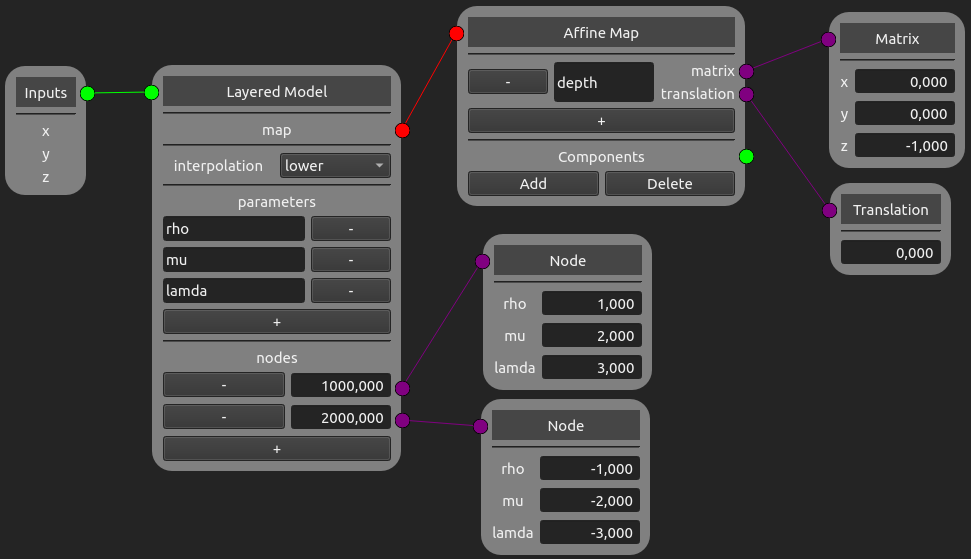

Builders
========

Builders are not components by itself, but build a subtree using available components. The following builder nodes implements the 
`builders <https://easyinit.readthedocs.io/en/latest/builders.html>`_ of easi. If you are not familiar with the different easi builders, please read the easi documentation first.

Note that easi-gui does not check for typos or wrong inputs.

Layered Model Node
------------------

This node implements `LayeredModel <https://easyinit.readthedocs.io/en/latest/builders.html#layeredmodel>`_ of easi.

Include Node
------------

This node implements `Include <https://easyinit.readthedocs.io/en/latest/builders.html#include>`_ of easi.

.. image:: fig/builders/include.png
  :alt: Include

