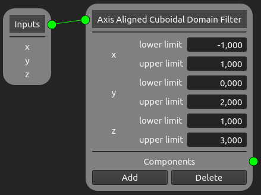
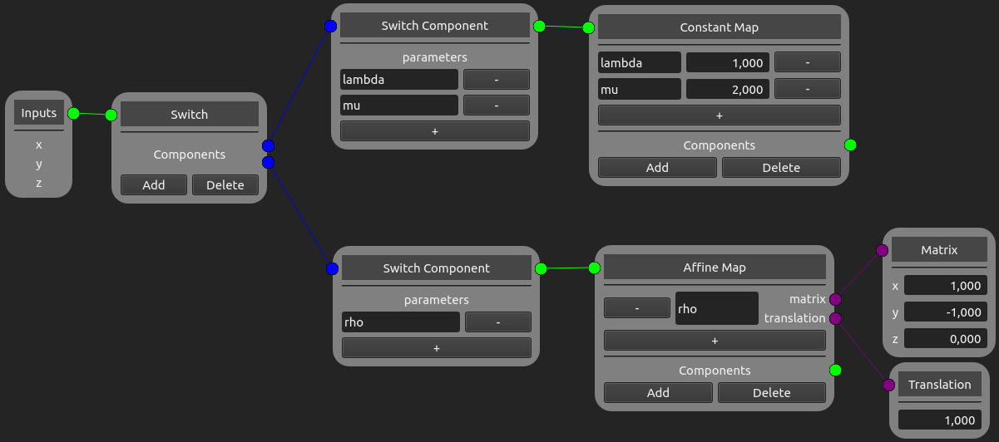

Filters
=======

Filters accept only a subsets of points and allows for the spatial partitioning of models. The following filter nodes implements the 
`filters <https://easyinit.readthedocs.io/en/latest/filters.html>`_ of easi. If you are not familiar with the different easi filters, please read the easi documentation first.

Note that easi-gui does not check for typos or wrong inputs.

Any Node
--------

This node implements `Any <https://easyinit.readthedocs.io/en/latest/filters.html#any>`_ of easi.

Axis Aligned Cuboidal Domain Filter Node
----------------------------------------

This node implements `AxisAlignedCuboidalDomainFilter <https://easyinit.readthedocs.io/en/latest/filters.html#axisalignedcuboidaldomainfilter>`_ of easi.

Spherical Domain Filter Node
----------------------------

This node implements `SphericalDomainFilter <https://easyinit.readthedocs.io/en/latest/filters.html#sphericaldomainfilter>`_ of easi.

Group Filter Node
-----------------

This node implements `GroupFilter <https://easyinit.readthedocs.io/en/latest/filters.html#groupfilter>`_ of easi.

.. image:: fig/filters/groupfilter.png
  :alt: GroupFilter

Switch Node
-----------

This node implements `Switch <https://easyinit.readthedocs.io/en/latest/filters.html#switch>`_ of easi.

