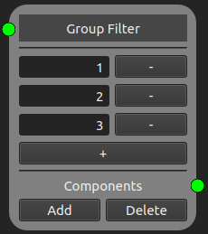

Filters
=======

Filters accept only a subset of points and allows for the spatial partitioning of models. The following filter nodes implements the 
`filters <https://easyinit.readthedocs.io/en/latest/filters.html>`_ of easi. If you are not familiar with the different easi filters, please read the easi documentation first.

Note that easi-gui does not check for typos or wrong inputs/outputs.

Any Node
--------

This node implements `Any <https://easyinit.readthedocs.io/en/latest/filters.html#any>`_ of easi. It mostly serves as a root node and accepts every point and every group.

.. image:: fig/filters/any.png
  :alt: Any

Axis Aligned Cuboidal Domain Filter Node
----------------------------------------

This node implements `AxisAlignedCuboidalDomainFilter <https://easyinit.readthedocs.io/en/latest/filters.html#axisalignedcuboidaldomainfilter>`_ of easi. It accepts only points inside an axis-aligned bounding box (see easi documentation).

.. figure:: fig/filters/axisalignedcuboidaldomainfilter.png
  :alt: AxisAlignedCuboidalDomainFilter
  
  This **Axis Aligned Cuboidal Domain Filter** node takes all points that satisfy the conditions: :math:`-1 \leq x \leq 1`, :math:`0 \leq y \leq 2` and :math:`1 \leq z \leq 3`.

When an input is given, the dimensions' names are automatically added to the **Axis Aligned Cuboidal Domain Filter** node. You then only need to give the lower and upper limits next to the labels of the same row.

Spherical Domain Filter Node
----------------------------

This node implements `SphericalDomainFilter <https://easyinit.readthedocs.io/en/latest/filters.html#sphericaldomainfilter>`_ of easi. It accepts only points inside a sphere.

.. figure:: fig/filters/sphericaldomainfilter.png
  :alt: SphericalDomainFilter
  
  This **Spherical Domain Filter** node takes all coordinates that satisfy :math:`||(x,y,z)^T - (1,2,3)^T|| \leq 1`.
  
The radius can be given in the box next to "radius". When an input is given, the dimensions' names are automatically added to the **Spherical Domain Filter** node. The value of the center corresponding to the dimension needs to be added in the box on the same row.
  
Group Filter Node
-----------------

This node implements `GroupFilter <https://easyinit.readthedocs.io/en/latest/filters.html#groupfilter>`_ of easi. It accepts only points belonging to a set of groups.

  
  This **Group Filter** node accepts the nodes that belong to the groups 1, 2 and 3.

The group values need to be written in the boxes of the **Group Filter** node.
  
The + button adds new group rows to the map, while the - button removes the group of the button's row.

Switch Node
-----------

This node implements `Switch <https://easyinit.readthedocs.io/en/latest/filters.html#switch>`_ of easi. It can be used to select a component based on the requested parameters.

.. figure:: fig/filters/switch.png
  :alt: Switch
  
  This **Switch** node separates the output parameters lambda, mu and rho, according to how they are computed. lambda and mu are determined using a **Constant Map** node and have respectively the values 1 and 2, while rho is defined via an affine map and has the value :math:`x-y+1`.
  
A **Switch** node always has at least one **Switch Component** node, in which the parameters need to be manually added. The + button adds new parameter rows to the map, while the - button removes the parameter of the button's row. As for normal components, **Switch Component** nodes can be further added by clicking on the "Add" button of the **Switch** node, while the "Delete" button removes the last **Switch Component** node.
