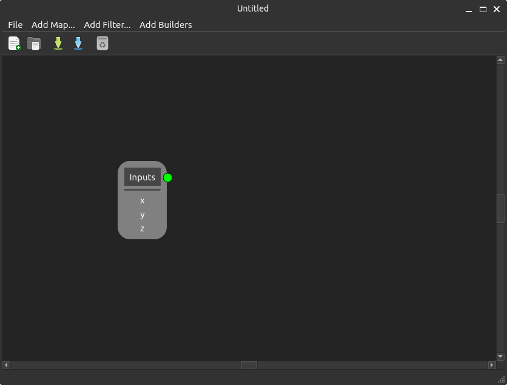
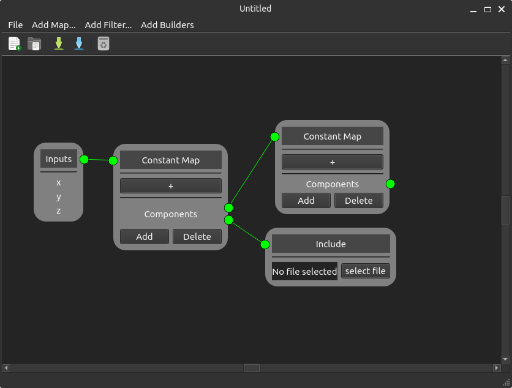
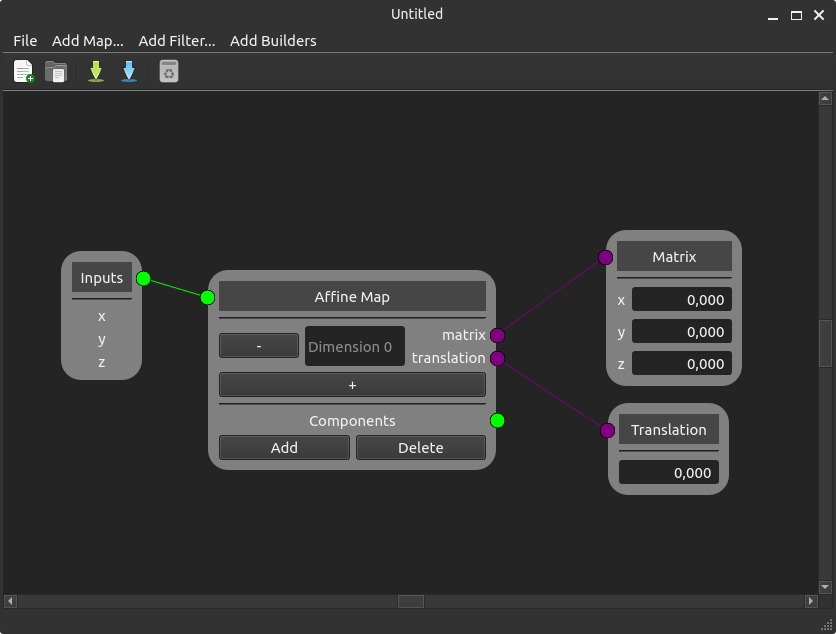
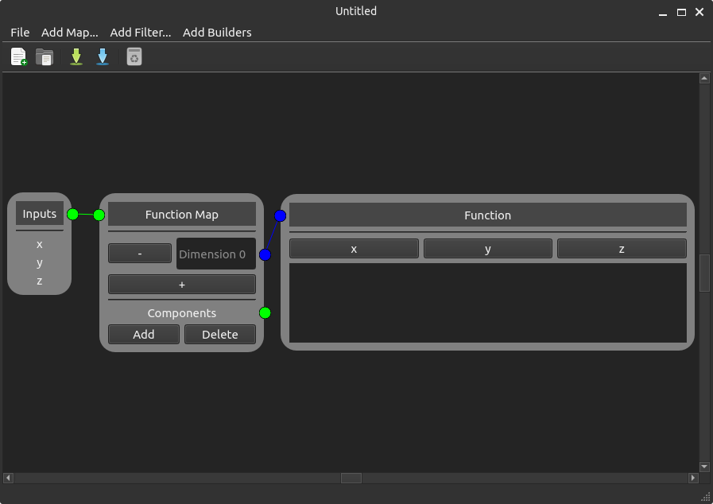
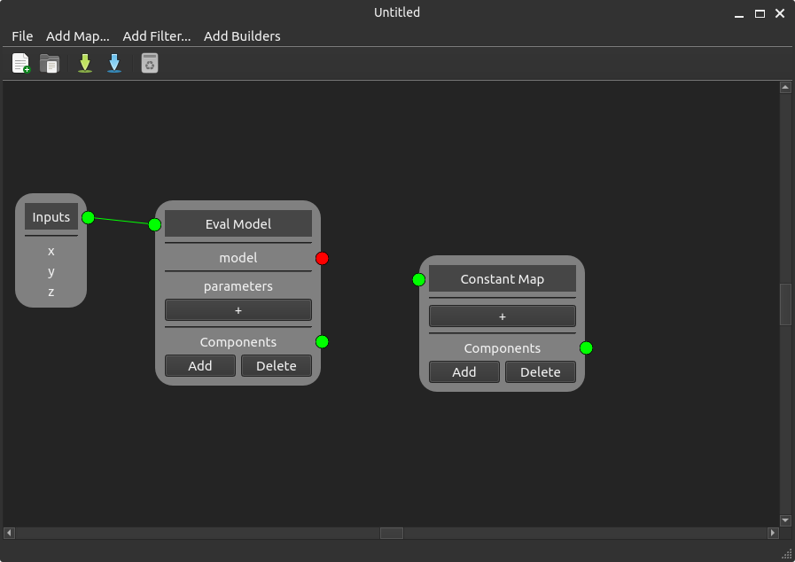
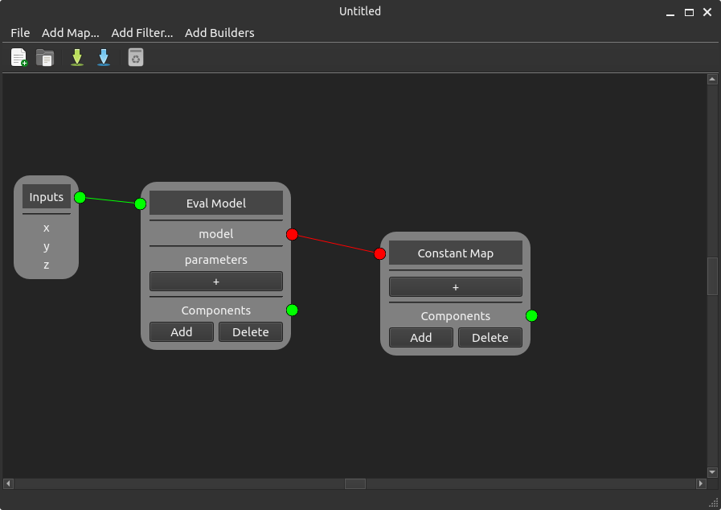

Getting Started with easi-gui
=============================

Now that easi-gui is running, let's see how it works.

Quick Overview
--------------

easi-gui possesses one node called **Inputs** that serves as root for the tree and that passes down point coordinates x,y and z to its child. A tree needs to be connected to Inputs in order to be saved. Saving creates a ``.yaml`` file for `easi <https://github.com/SeisSol/easi>`_, while opening a ``.yaml`` file creates the tree.

  
  easi-gui

Children nodes are called components. If a node can have several children, it has a part called "Components". Components can be added by clicking on the "Add" button below "Components", while the "Delete" button removes the last component.

  
  The **Constant Map** node has two children: an **Include** node and another **Constant Map** node.

Color codes
-----------

Connectors have different colors regarding their meaning :

* Green connectors are the basic connectors that connect nodes to one another. They can be connected to green and red connectors. When connected to a red connector, it becomes red (see below). 
* Violet connectors connect mathematical nodes to their parents. They can only be connected to the same color.
* Blue connectors connect non-mathematical nodes to their parents. They can only be connected to the same color.
* Red connectors connect subtrees, that are not handled as components, to their parents. Red connectors can be connected to red and green connectors. When connected to a green connector, this later becomes red.

Here are some examples:

  
  The **Matrix** and **Translation** nodes are connected to the **Affine Map** node via violet connectors.
  

  
  The **Function** node is connected to the **Function Map** node via a blue connector.
  

  
  The **Constant Map** node is not connected to any nodes and its input connector is green.
  

  
  The **Constant Map** node is connected to the **Eval Model** node via a red connector. Its input connector is red.
