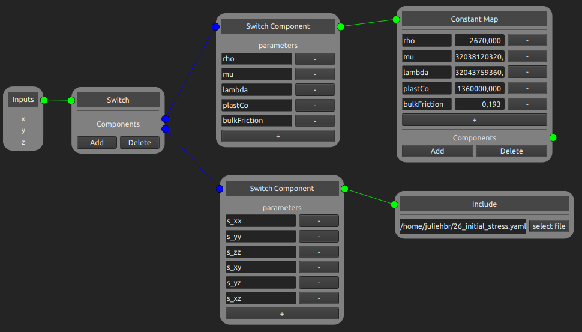

.. easi-gui documentation master file, created by
   sphinx-quickstart on Sat Mar 18 14:15:53 2023.
   You can adapt this file completely to your liking, but it should at least
   contain the root `toctree` directive.

Welcome to easi-gui's documentation!
====================================

easi-gui is a node-based interface designed to ease the initialisation of models with the library `easi <https://github.com/SeisSol/easi>`_. Note that easi-gui evaluate only takes three dimensional points as input for now. It opens and saves `YAML <http://yaml.org>`_ configuration files written with the syntax described by easi. It works the same way as easi does: it possesses two types of nodes, Map and Filter, that are connected together as a tree. If you are not familiar with easi, please read the `easi documentation <https://easyinit.readthedocs.io/en/latest/index.html>`_ first.

Here an example of how easi-gui can be used:

  Graph corresponding to the example `26_function.yaml <https://github.com/SeisSol/easi/blob/master/examples/26_function.yaml>`_ of easi.

You may need to want to expand easi-gui by adding to answer future changes of easi. You can find a quick overview on the `program's structure <https://easi-gui.readthedocs.io/en/latest/program_structure.html>`_ and a tutorial on `How to create new nodes <https://easi-gui.readthedocs.io/en/latest/adding_nodes.html>`_ in this documentation. The tutorial is here to help you understand how the code works. Note that in most cases, you will just need to copy paste parts of code that already exist. Don't hesitate to look at the implementation of nodes that have similar functionalities to the one you want to create (e.g. polynomial map for the implementation of `extra nodes <https://easi-gui.readthedocs.io/en/latest/program_structure.html#nodes>`_).

.. toctree::
   :maxdepth: 2
   :caption: Contents:

   getting_started
   maps
   filters
   builders
   program_structure
   adding_nodes
