Maps
====

A map allows to map vectors from :math:`\mathbb{R}^m` to :math:`\mathbb{R}^n`. The following map nodes implements the 
`maps <https://easyinit.readthedocs.io/en/latest/maps.html>`_ of easi. If you are not familiar with the different easi maps, please read the easi documentation first.

Note that easi-gui does not check for typos or wrong inputs.

Constant Map Node
-----------------

This node implements `ConstantMap <https://easyinit.readthedocs.io/en/latest/maps.html#constantmap>`_ of easi. It assigns a constant value independently of the position.

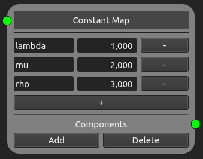

  This Constant Map node declares three dimensions lambda, mu and rho that have respectively the values 1, 2 and 3.
  
The dimension's name needs to be written in the text field and its corresponding value in the spin box of the same row.

The + button adds new dimension rows to the map, while the - button removes the dimension of the button's row.

Identity Map Node
-----------------

This node implements `IdentityMap <https://easyinit.readthedocs.io/en/latest/maps.html#identitymap>`_ of easi. It does nothing in particular (same as the Any node).

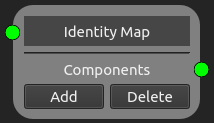

Affine Map Node
---------------

This node implements `AffineMap <https://easyinit.readthedocs.io/en/latest/maps.html#affinemap>`_ of easi. It implements the affine mapping :math:`y=Ax+t`.

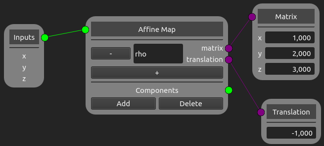
  
  This Affine Map node defines a dimension named rho that has for value :math:`x + 2y + 3z -1`.
  
The dimension's name needs to be written in the text field in the Affine Map node. When an input is given, the dimensions' names are automatically added to the Matrix node. Each input is then multiplied by the value given in the spin box of the same row, as described in the `example in the documentaion of easi <https://easyinit.readthedocs.io/en/latest/maps.html#identitymap>`_. 

The + button adds new dimension rows to the map, while the - button removes the dimension of the button's row.

Polynomial Map Node
-------------------

This node implements `PolynomialMap <https://easyinit.readthedocs.io/en/latest/maps.html#polynomialmap>`_ of easi. It assigns a value using a polynomial for every parameter.

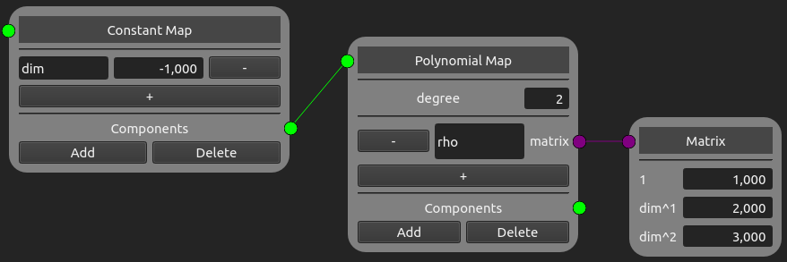
  
  This Polynomial Map Node declares a dimension named rho that has as value the following quadratic polynomial :math:`1 + 2*dim + 3*dim^3`.
  
The dimension's name needs to be written in the text field in the Polynomial Map node. The degree of the polynomial is given in the spin box, next to "degree". When an input is given, the dimension's name is automatically added to the Matrix node. Each polynomial term will be multiplied by the spin box's value of the same row.

The + button adds new dimension rows to the map, while the - button removes the dimension of the button's row.

Function Map Node
-----------------

This node implements `FunctionMap <https://easyinit.readthedocs.io/en/latest/maps.html#functionmap>`_ of easi. It implements a mapping described by an ImpalaJIT function.

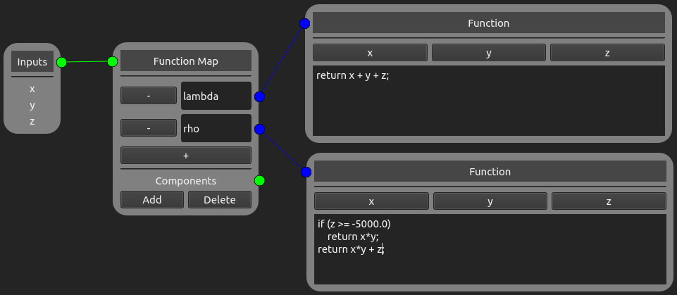

  This Function Map Node defines two dimensions: lambda and rho, where lambda :math:`=x+y+z`, and rho :math:`=x*y` if :math:`z>=-5000`, :math:`x*y+z` otherwise.
  
The dimension's name needs to be written in the text field in the Function Map node. The function is written in the Function node. When an input is given, the dimensions' names are automatically added to the Function node as buttons, and can be added to the function by clicking on them.

The + button adds new dimension rows to the map, while the - button removes the dimension of the button's row.

Lua Map Node
------------

This node implements `LuaMap <https://easyinit.readthedocs.io/en/latest/maps.html#luamap>`_ of easi. It implements a mapping described by a Lua function.

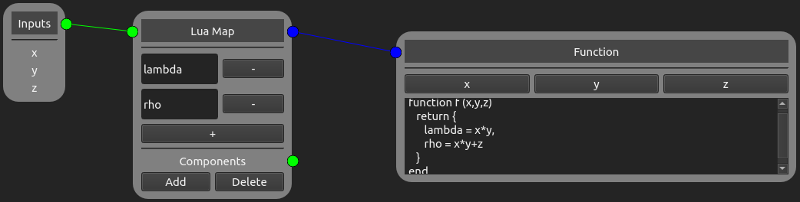
  
  This Lua Map Node defines two dimensions: lambda and rho, where lambda :math:`=x+y+z`, and rho :math:`=x*y+z`.
  
The dimension's name needs to be written in the text field in the Lua Map node. The function is written in the Function node. When an input is given, the dimensions' names are automatically added to the Function node as buttons, and can be added to the function by clicking on them.

The + button adds new dimension rows to the map, while the - button removes the dimension of the button's row.

ASAGI Node
----------

This node implements `ASAGI <https://easyinit.readthedocs.io/en/latest/maps.html#asagi>`_ of easi. It looks up values using ASAGI (with trilinear interpolation).

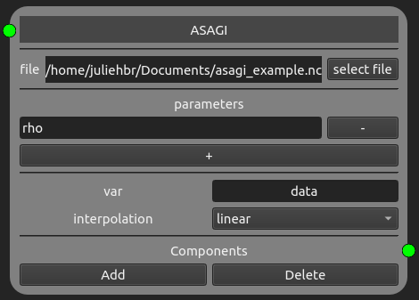
  
  This ASAGI Node gets its parameter rho from the file asagi_example.nc. The variable of the file is data, and the interpolation used is the linear one.
  
The NetCDF file can be added by clicking on the button "select file". The parameters as well as the variable need to be added manually to the ASAGI node. Note that the parameters need to be added in the same order as they appear in the NetCDF file. The interpolation can be chosen between nearest neighbour and linear, the latest being the default one.

The + button adds new parameter rows to the map, while the - button removes the parameter of the button's row.

SCEC File Node
--------------

This node implements `SCECFile <https://easyinit.readthedocs.io/en/latest/maps.html#scecfile>`_ of easi. It looks up fault parameters in SCEC stress file (see easi documentation).

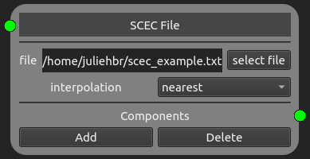
  
  This SCEC File node uses the file scec_example.txt and the interpolation is nearest neighbour.
  
The text file can be added by clicking on the button "select file". The interpolation can be chosen between nearest neighbour and linear, the latest being the default one.

Note that the outputs of the SCEC File node are always "cohesion", "d_c", "forced_rupture_time", "mu_d", "mu_s", "s_dip", "s_normal" and "s_strike".

Eval Model Node
---------------

This node implements `EvalModel <https://easyinit.readthedocs.io/en/latest/maps.html#evalmodel>`_ of easi. It provides values by evaluating another easi tree.

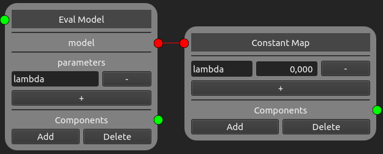

  This Eval Model node has for model a Constant Map node, that defines a dimension named lambda. This node being a child of the model tree, its dimension becomes a parameter of the Eval Model node.

The model can be connected as any component is connected to its parent. Note that the dimensions' names of all the children of the model tree need to be added manually into the Eval Model node. 

The + button adds new parameter rows to the map, while the - button removes the parameter of the button's row.

Optimal Stress Node
-------------------

This node implements `OptimalStress <https://easyinit.readthedocs.io/en/latest/maps.html#optimalstress>`_ of easi. It allows computing the stress which would result in faulting in the rake direction on the optimally oriented plane defined by strike and dip angles (see easi documentation for further information).

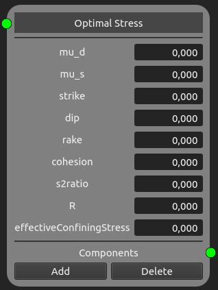
  
  This Optmial Stress node defined all constants as null.
  
The values of each constant can be given in the spin boxes of the same row of its corresponding constant.

Note that the outputs of the Optimal Stress node are always the stress components: "s_xx", "s_yy", "s_zz", "s_xy", "s_yz", and "s_xz".
  
Andersonian Stress Node
-----------------------

This node implements `AndersonianStress <https://easyinit.readthedocs.io/en/latest/maps.html#andersonianstress>`_ of easi. It allows computing Andersonian stresses (see easi documentation for further information).

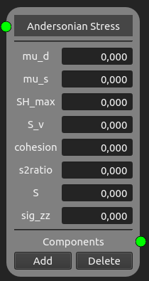
 
  This Andersonian Stress node defined all constants as null.
  
The values of each constant can be given in the spin boxes of the same row of its corresponding constant.

Note that the outputs of the Andersonian Stress node are always the stress components: "s_xx", "s_yy", "s_zz", "s_xy", "s_yz", and "s_xz".
